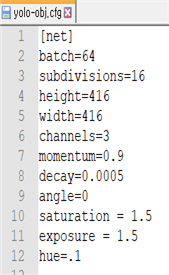
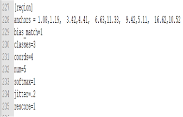
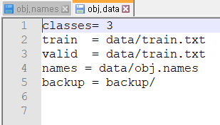
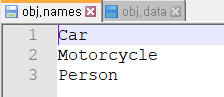

# SKU-CE16  

### 환경

* Windows 10 Pro
* i7-8700
* GTX 1080
* RAM 16G
* Visual studio 2019
* CUDA 10.1
* cuDNN 7.6.5
* OpenCV 4.2.1
* darknet
* yolo v3
* yolo mark
* jupyter notebook  

  

### 데이터 처리

이미지파일, json 파일을 제공받았다.

json 파일에 각 객체에 대한 **좌표값**과 **라벨링**이 되어있음을 확인했다.

yolo_mark는 이미지에 bounding box 즉, 좌표값과 라벨링을 하여 학습데이터를 과정입니다.

하지만 이미지 하나하나 라벨링 하기에는 비효율적이라 생각하여, 제공받은 json파일에 있는 

좌표값과 라벨링이 있기 때문에 이점을 이용하였습니다.  

* json파일을 yolo의 input인 txt형식에 맞게 변환 (학습 데이터 형성)  

  

### 학습을 위한 준비  

학습에 필요한 파일 목록

* CNN 레이어의 구조를 정의하는 cfg 파일
* 학습 시킬 이미지 파일과 객체 좌표, 라벨링된 텍스트 파일
* 학습 이미지 경로들이 담긴 txt파일 (train.txt, valid.txt)
* 클래스의 종류가 담긴 name파일 (obj.names)
* 경로들을 담고있는 data파일(obj.data)
* 학습시킨 가중치 정보가 들어있는 weights파일  

yolo-obj.cfg파일 수정

    

    

* batch-size 64장
* subdivision 16장
* 분류해야할 라벨 총 3개(차, 오토바이, 사람)이므로 classes를 3으로 수정  

obj.data파일 수정

    

* 3개의 종류로 분류를 하기 때문에 classes를 3으로 수정
* train, valid, names, backup 의 경로를 지정  

obj.names파일 수정

    

* 차, 오토바이, 사람에 대한 이름을 위와 같이 정의  

  

### 학습

학습을 위해서 darknet을 사용했습니다. darknet의 학습은 CPU 와 GPU 2가지 방식이 있습니다.

그 중 **GPU를 사용해서 학습**했습니다.  

GPU 사용을 위한 준비

* CUDA와 cuDNN 버전을 맞춰줘야 합니다.

